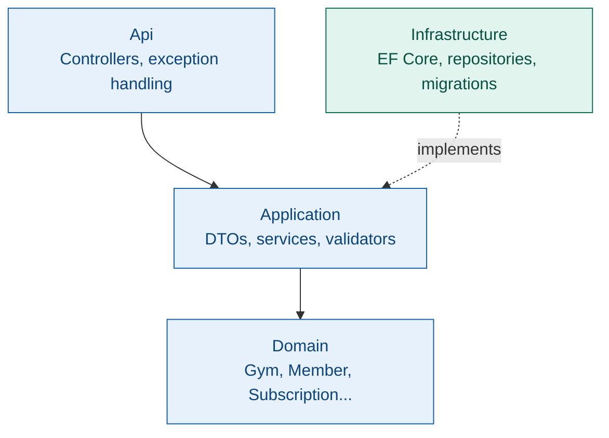
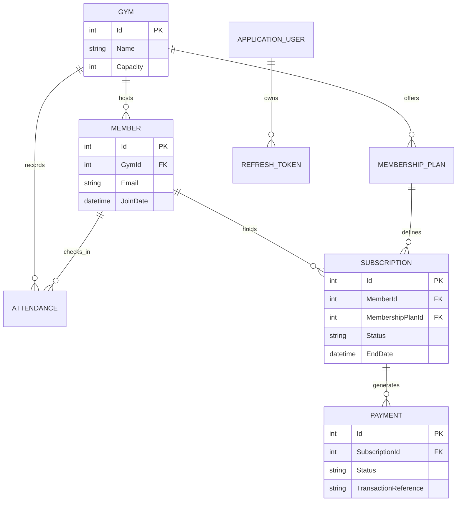

# Gym Management System

A REST API for managing gym operations — members, subscriptions, payments, attendance — built with ASP.NET Core 9 and EF Core, following Clean Architecture with Repository + Unit of Work.

[](https://dotnet.microsoft.com/)
[](https://learn.microsoft.com/en-us/ef/core/)
[](LICENSE)

---

## What this is

A gym has locations, members, membership plans, and subscriptions that move through a lifecycle (`Active → Frozen → Expired/Cancelled`). Members check in, which is validated against an active subscription at the correct gym. Collection endpoints (members, subscriptions, attendance) compose filters/search/pagination as `IQueryable`, so EF Core translates them to SQL instead of loading full tables into memory.

This is an internal operations API for gym staff — not a customer-facing app. There's no member login; members are records that staff create and manage.

---

## Tech stack

**API:** ASP.NET Core 9 · EF Core · SQL Server · ASP.NET Core Identity + JWT
**Validation/Mapping:** FluentValidation · AutoMapper
**Testing:** xUnit · `WebApplicationFactory`
**Protection:** ASP.NET Core rate limiting on `/api/auth/login`

---

## Architecture



- **Api** — controllers, global exception handling middleware
- **Application** — DTOs, services, FluentValidation validators, repository/UoW interfaces, AutoMapper profiles
- **Domain** — entities: `Gym`, `Member`, `MembershipPlan`, `Subscription`, `Payment`, `Attendance`, `RefreshToken`
- **Infrastructure** — EF Core `ApplicationDbContext`, repository implementations, migrations, Identity persistence

---

## Auth

Login issues a short-lived JWT access token plus a refresh token; `POST /api/auth/refresh` exchanges a valid refresh token for a new pair. The refresh token is generated with `RandomNumberGenerator`, hashed (SHA-256) before storage, and single-use — refreshing revokes the old token and issues a new pair.

Roles (`Admin`, `Manager`, `Receptionist`) are seeded and included as JWT claims. Endpoints are role-gated by what the action actually affects, not uniformly:

| Role | Can do |
|---|---|
| `Admin` | Everything, plus structural/destructive actions: delete a gym or plan, register new staff |
| `Manager` | Revenue-affecting actions: create plans, cancel/freeze/unfreeze subscriptions |
| `Receptionist` | Front-desk actions: enroll members, sell subscriptions, check members in |

Reads are open to any authenticated staff role. `/api/auth/login` is rate-limited to blunt credential-stuffing attempts.

### Entity relationships



---

## Concurrency handling

The part of this project that isn't standard CRUD: three write paths had race conditions under concurrent requests, and each needed a different fix because they're different problems wearing the same "add a transaction" disguise.

**Subscription creation writes to two tables (`Subscription`, then `Payment`) and both need to succeed or neither should.** This is wrapped in an explicit `IDbContextTransaction`, committed only after both inserts succeed, rolled back on any failure — so a payment-insert failure can't leave an orphaned active subscription with no payment record.

**Refresh token rotation had a read-then-write gap.** The old code checked `IsActive` in application code, then separately wrote `RevokedOn`. Two concurrent refresh requests using the same token could both read "active" before either wrote the revocation, producing two valid token pairs from one single-use token. Fixed with a single atomic conditional update instead of a transaction:
```csharp
await _context.RefreshTokens
    .Where(rt => rt.Id == id && rt.RevokedOn == null && rt.ExpiresOn > DateTime.UtcNow)
    .ExecuteUpdateAsync(s => s.SetProperty(rt => rt.RevokedOn, DateTime.UtcNow));
```
The database enforces the check-and-write as one indivisible statement — a losing concurrent request updates zero rows and is rejected, rather than the race being possible at all.

**Gym capacity enforcement is a read (member count) followed by a write (insert) with nothing linking them.** Under the database's default isolation level, two concurrent registrations can both read the count as under capacity before either commits — both pass the check, capacity gets exceeded. This needed `Serializable` isolation specifically (not just any transaction — default `Read Committed` doesn't block this), so the database itself detects the conflict and rejects one of the two competing transactions:
```csharp
await using var transaction = await _unitOfWork.BeginTransactionAsync(IsolationLevel.Serializable);
```

The distinction that mattered across all three: an explicit transaction, an atomic conditional update, and a raised isolation level are three different tools for three different shapes of race condition — not one fix copy-pasted three times.

---

## API surface

| Method | Endpoint | Auth | Notes |
|---|---|---|---|
| POST | `/api/auth/login` | — | Rate-limited |
| POST | `/api/auth/register` | Admin | |
| POST | `/api/auth/refresh` | — | Rotates refresh token |
| GET | `/api/gyms`, `/api/gyms/{id}` | Any staff | |
| POST/PUT/DELETE | `/api/gyms` | Admin | Soft delete |
| GET | `/api/members` | Any staff | Paginated, searchable, filterable by gym |
| POST | `/api/members` | Any staff | |
| PUT/DELETE | `/api/members/{id}` | Admin | |
| GET | `/api/plans`, `/api/plans/gym/{gymId}` | Any staff | |
| POST/PUT | `/api/plans` | Admin, Manager | |
| DELETE | `/api/plans/{id}` | Admin | Soft delete |
| GET | `/api/subscriptions`, `/{id}` | Any staff | Filter by status, member, plan, date range |
| POST | `/api/subscriptions` | Admin, Manager, Receptionist | Creates subscription + payment atomically |
| POST | `/api/subscriptions/{id}/cancel` \| `freeze` \| `unfreeze` | Admin, Manager | State transitions |
| POST | `/api/attendance/check-in` | Admin, Manager, Receptionist | Validates active subscription for that gym |
| GET | `/api/attendance/gym/{gymId}`, `/history/{memberId}` | Admin, Manager | Paginated |

**Example — paginated member search:**

```
GET /api/members?PageNumber=1&PageSize=10&SearchTerm=ahmed&GymId=3
```

```json
{
  "items": [ /* MemberDto[] */ ],
  "totalCount": 47,
  "currentPage": 1,
  "pageSize": 10,
  "totalPages": 5,
  "hasNextPage": true,
  "hasPreviousPage": false
}
```

---

## Business rules

- Subscription transitions are guarded: only `Active` can freeze, only `Frozen` can unfreeze
- Freeze duration capped at 1–90 days
- A member can't hold two active subscriptions to the same plan
- Gym capacity can't be exceeded — enforced under `Serializable` isolation, see above
- Check-in rejected if the subscription is frozen/expired/cancelled, or belongs to a different gym
- Member emails are unique, enforced by a DB index, not just application logic

---

## Testing

Integration tests run through `WebApplicationFactory` against the real middleware pipeline, including a test verifying rate-limited requests are rejected with `429` before reaching the controller.

**Current coverage:** Member CRUD (controller unit tests + integration tests) and rate limiting. Auth, Subscriptions, and Attendance — including the concurrency fixes above — aren't covered by automated tests yet; they've been verified manually. That's the next priority for this project, specifically a concurrent-request test against the capacity check and refresh-token rotation, since those are exactly the kind of bug a single-threaded test won't catch.

---

## Running it locally

```bash
git clone https://github.com/Ommmarr111/Gym-Management-System.git
cd Gym-Management-System
dotnet ef database update --project GymManagementSystem.Infrastructure --startup-project GymManagementSystem.Api
dotnet run --project GymManagementSystem.Api
```

Set `ConnectionStrings:DefaultConnection` and `Jwt:Key`/`Jwt:Issuer`/`Jwt:Audience` via user secrets or environment variables, not committed config.

Swagger: `https://localhost:<port>/swagger`

---

## Author

**Omar Ahmed** — [GitHub](https://github.com/Ommmarr111) · [LinkedIn](https://linkedin.com/in/Ommmarr111)
