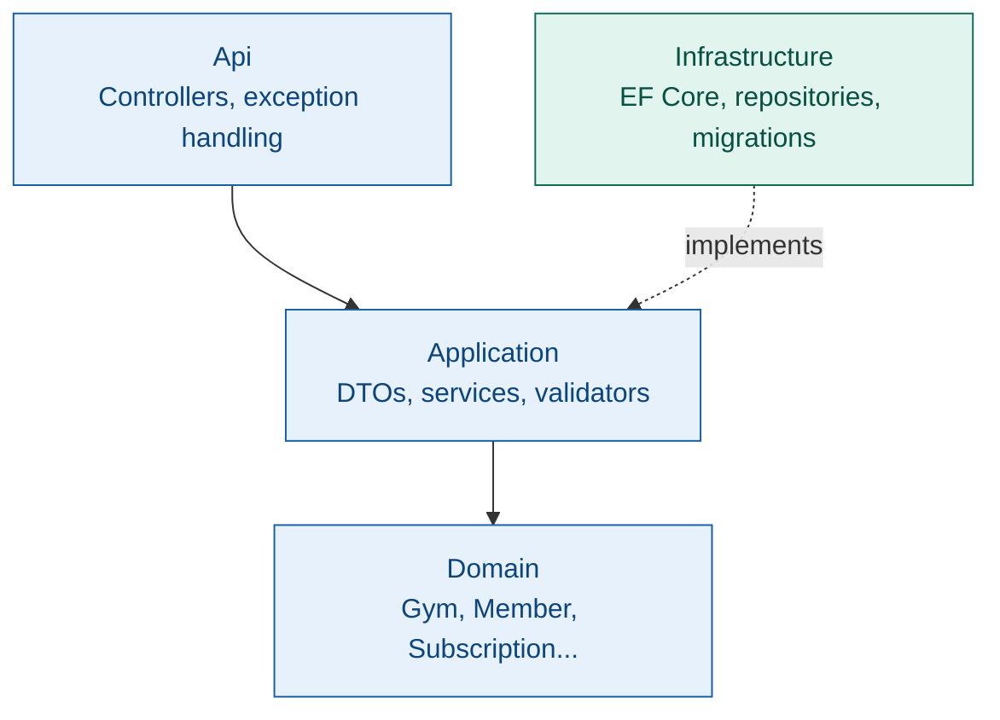
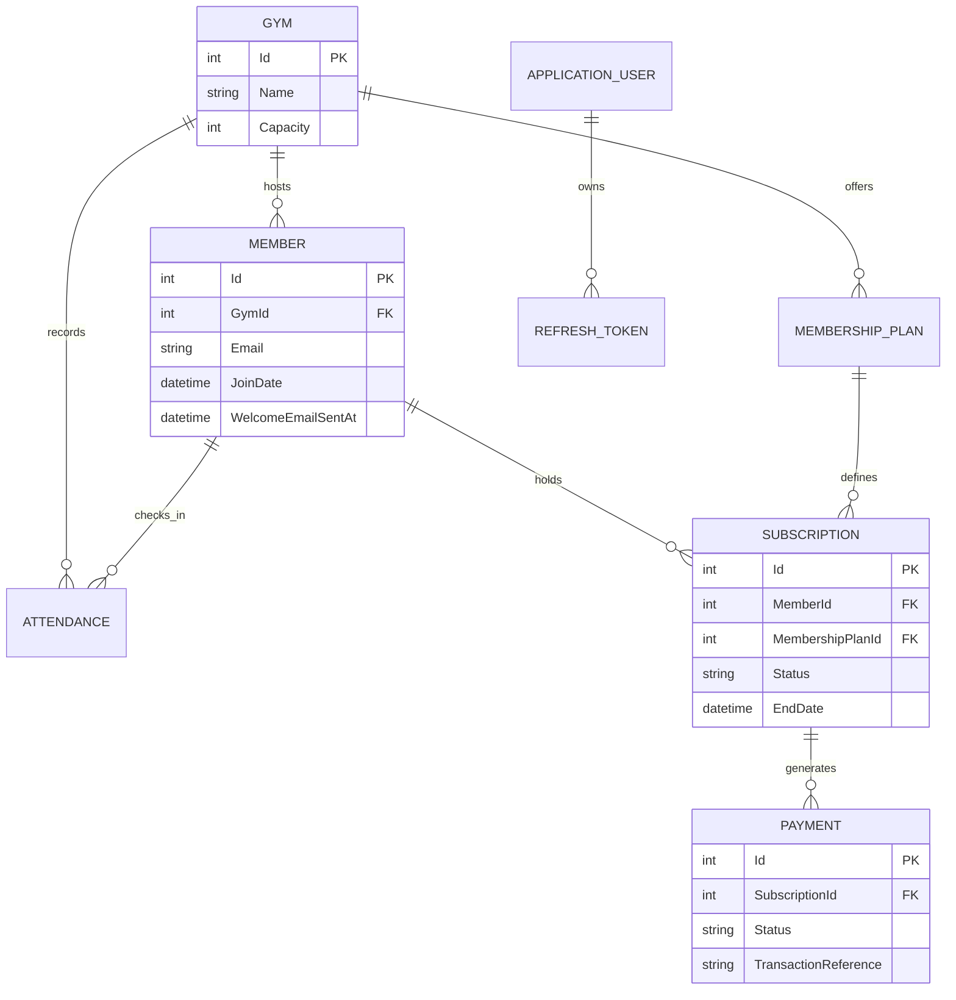

# Gym Management System

A REST API for managing gym operations — members, subscriptions, payments, attendance — built with **ASP.NET Core 9** and **EF Core**, following Clean Architecture with the Repository + Unit of Work pattern.

[](https://dotnet.microsoft.com/)
[](https://learn.microsoft.com/en-us/ef/core/)
[](https://www.microsoft.com/en-us/sql-server)

---

## Table of contents

- [What this is](#what-this-is)
- [Tech stack](#tech-stack)
- [Architecture](#architecture)
- [Auth](#auth)
- [Entity relationships](#entity-relationships)
- [Concurrency handling](#concurrency-handling)
- [Caching](#caching)
- [Background jobs](#background-jobs)
- [Logging & observability](#logging--observability)
- [API surface](#api-surface)
- [Business rules](#business-rules)
- [Testing](#testing)
- [Running it locally](#running-it-locally)
- [Author](#author)

---

## What this is

A gym has locations, members, membership plans, and subscriptions that move through a lifecycle (`Active → Frozen → Expired/Cancelled`). Members check in, and each check-in is validated against an active subscription at the correct gym. Collection endpoints (members, subscriptions, attendance) compose filters, search, and pagination as `IQueryable`, so EF Core translates them to SQL instead of loading full tables into memory.

> This is an **internal operations API for gym staff** — not a customer-facing app. There's no member login; members are records that staff create and manage.

---

## Tech stack

| Layer | Technology |
|---|---|
| API | ASP.NET Core 9, EF Core, SQL Server |
| Auth | ASP.NET Core Identity + JWT |
| Validation / Mapping | FluentValidation, AutoMapper |
| Caching | `IMemoryCache` (most endpoints) and `IDistributedCache`/Redis (gym-scoped plan lookups) — mixed as part of an in-progress migration, see [Caching](#caching) |
| Background jobs | Hangfire — recurring subscription expiry, fire-and-forget welcome emails, see [Background jobs](#background-jobs) |
| Logging | Serilog — structured logging, correlation IDs, console + rolling file sinks, see [Logging & observability](#logging--observability) |
| Testing | xUnit, `WebApplicationFactory` |
| Protection | ASP.NET Core rate limiting on `/api/auth/login` |

---

## Architecture



| Layer | Responsibility |
|---|---|
| **Api** | Controllers, global exception handling middleware |
| **Application** | DTOs, services, FluentValidation validators, repository/UoW interfaces, AutoMapper profiles, background job definitions |
| **Domain** | Entities: `Gym`, `Member`, `MembershipPlan`, `Subscription`, `Payment`, `Attendance`, `RefreshToken` |
| **Infrastructure** | EF Core `ApplicationDbContext`, repository implementations, migrations, Identity persistence |

---

## Auth

Login issues a short-lived **JWT access token** and a **refresh token**. `POST /api/auth/refresh` exchanges a valid refresh token for a new pair. Refresh tokens are generated using `RandomNumberGenerator` and stored only as **SHA-256 hashes** — the raw token is never persisted.

**Rotation is single-use and race-safe.** Refreshing performs an atomic conditional update (`UPDATE ... WHERE Id = @id AND RevokedOn IS NULL AND ExpiresOn > <current UTC time>`), so two concurrent requests can't both successfully reuse the same token — only one wins the update. Revocation is committed independently of issuing the new pair: if issuance fails after the old token is revoked, that revocation is **not rolled back**, so a failed issuance can never re-validate an already-revoked token.

**Reuse is treated as theft.** If a refresh token that was already revoked (and not simply expired) is presented again, all active refresh tokens for that user are revoked, forcing re-authentication. This is user-wide, not session- or device-specific — reuse detected on one compromised session revokes every session, including unaffected devices — since reuse detection can't currently tell which session was compromised, and a rare transient failure during issuance can leave a revoked-but-not-replaced token. Both trade-offs favor security over convenience.

**Roles are seeded and claim-based:** `Admin` can do everything plus structural/destructive actions (delete a gym or plan, register new staff); `Manager` handles revenue-affecting actions (create plans, cancel/freeze/unfreeze subscriptions); `Receptionist` covers front-desk actions (enroll members, sell subscriptions, check members in). Reads are open to any authenticated staff role, and `/api/auth/login` is rate-limited to blunt credential-stuffing attempts.

---

## Entity relationships



---

## Concurrency handling

The part of this project that isn't standard CRUD: three write paths had race conditions under concurrent requests, and each needed a different fix — because they're different problems wearing the same "add a transaction" disguise.

**1. Subscription creation writes to two tables (`Subscription`, then `Payment`), and both need to succeed or neither should.**
This is wrapped in an explicit `IDbContextTransaction`, committed only after both inserts succeed and rolled back on any failure — so a payment-insert failure can't leave an orphaned active subscription with no payment record.

**2. Refresh token rotation had a read-then-write gap.**
The old code checked `IsActive` in application code, then separately wrote `RevokedOn`. Two concurrent refresh requests using the same token could both read "active" before either wrote the revocation, producing two valid token pairs from one single-use token. Fixed with a single atomic conditional update instead of a transaction:

```csharp
await _context.RefreshTokens
    .Where(rt => rt.Id == id && rt.RevokedOn == null && rt.ExpiresOn > DateTime.UtcNow)
    .ExecuteUpdateAsync(s => s.SetProperty(rt => rt.RevokedOn, DateTime.UtcNow));
```

The database enforces the check-and-write as one indivisible statement — a losing concurrent request updates zero rows and is rejected, rather than the race being possible at all.

**3. Gym capacity enforcement is a read (member count) followed by a write (insert) with nothing linking them.**
Under the database's default isolation level, two concurrent registrations can both read the count as under capacity before either commits — both pass the check, and capacity gets exceeded. This needed `Serializable` isolation specifically (not just any transaction — the default `Read Committed` doesn't block this), so the database itself detects the conflict and rejects one of the two competing transactions:

```csharp
await using var transaction = await _unitOfWork.BeginTransactionAsync(IsolationLevel.Serializable);
```

The distinction that mattered across all three: an explicit transaction, an atomic conditional update, and a raised isolation level are three different tools for three different shapes of race condition — not one fix copy-pasted three times.

---

## Caching

Membership plan reads use a cache-aside pattern, currently split across two backends as part of an incremental migration:

- `GetAllPlansAsync` and `GetPlanByIdAsync` use `IMemoryCache.GetOrCreateAsync` (in-process, single-instance) — the built-in method locks per-key, so concurrent requests during a cache miss don't all hit the database at once.
- `GetPlansByGymIdAsync` uses `IDistributedCache` (Redis) via a small `GetOrSetAsync` helper, since this was the endpoint targeted for a shared, multi-instance-safe cache.

Writes (create/update/delete) invalidate all three cache keys across both backends — the in-memory "all plans" and "single plan" keys, and the Redis-backed gym-scoped key — rather than relying on TTL expiry alone.

Manual measurement on the gym-scoped endpoint: cold reads (DB hit) consistently take over 100ms, dropping to single-digit ms on a cache hit.

**Known gaps — left deliberate, not hidden:**

- The two `IMemoryCache` endpoints haven't been migrated to Redis yet. In a real multi-instance deployment they'd serve stale/inconsistent data across instances, unlike the Redis-backed endpoint.
- The Redis path doesn't yet guard against a cache stampede (concurrent requests all missing the cache at once and hitting the DB together). `IMemoryCache.GetOrCreateAsync` handles this per-key locking for free; `IDistributedCache` has no built-in equivalent, so this needs a distributed lock (e.g. Redis `SETNX` or RedLock) as a follow-up.
- Cache invalidation against Redis has no fault isolation: if Redis is unreachable, the `RemoveAsync` call throws and the exception propagates up, failing the entire write request even though the underlying database write already succeeded. This surfaced directly during local testing (Redis wasn't running). Wrapping the Redis call in a try/catch (log and continue) is a known, understood fix, deliberately not yet applied.

Cache invalidation across all three keys is covered by integration tests (see [Testing](#testing)) — writing them earlier caught a real bug: the member repository was missing `.Include(m => m.Gym)`, so `GymName` silently returned a fallback value instead of the actual gym.

---

## Background jobs

Two Hangfire jobs, each demonstrating a different scheduling model and a different flavor of the same underlying concern: **a job that runs more than once must never cause more damage than a job that runs once.**

**`expire-overdue-subscriptions` (recurring, hourly)** — checks for subscriptions still marked `Active` past their `EndDate` and flips them to `Expired`. Idempotent by construction: once a subscription is expired, it no longer matches the `Status == Active` filter the job queries against, so re-running it — on overlap, a server restart, or a manual trigger from the Hangfire dashboard — is always a safe no-op for records already processed. No separate tracking flag is needed here; the state transition itself is the guard.

**Welcome email (fire-and-forget, triggered on member creation)** — enqueued via `BackgroundJob.Enqueue<IEmailServiceJob>(...)` right after a member is successfully created, so the API returns `201` immediately instead of waiting on email delivery. Unlike the expiry job, sending an email has no natural idempotency — Hangfire's default retry behavior means a transient failure on a real provider (SMTP/SendGrid) could otherwise resend the same email. This is guarded explicitly with a `WelcomeEmailSentAt` timestamp on `Member`, checked before sending and set immediately after: a retried or duplicated job execution finds the timestamp already set and returns without sending again. The job is enqueued with the member's `Id` rather than their email/name directly, so it always re-fetches current state — including that guard — rather than acting on values captured at enqueue time.

Hangfire's dashboard (`/hangfire`) exposes both jobs' schedules and run history, and supports manually triggering a run for testing without waiting for the next scheduled or enqueued execution.

**Not yet covered by automated tests** — both verified manually via the dashboard's manual trigger (the expiry job against a subscription with a backdated `EndDate`; the email job by triggering it twice against the same member and confirming the second run is a no-op).

---

## Logging & observability

Serilog replaces the default logging provider, writing structured logs to the console and to a daily rolling file (`Logs/log-.txt`), enriched with a **correlation ID** per HTTP request via `Enrich.WithCorrelationId()`. `UseSerilogRequestLogging()` logs every request's method, path, status code, and duration automatically, with no code written per endpoint.

**Structured, not string-interpolated.** Every log call uses named placeholders (`_logger.LogWarning("Login failed — no account for email {Email}", dto.Email)`), not `$"..."` interpolation — the difference matters because a real log sink (Seq, Application Insights) can query on `Email` or `MemberId` as an actual structured field, not grep through free text.

Logging is applied deliberately, not everywhere — routine CRUD reads and writes aren't logged, since that would just be noise. It's placed at points with real diagnostic or security value:

- **Auth** — failed login attempts (distinguishing "no such account" from "wrong password" internally, while the client-facing error stays intentionally identical for both). Refresh token reuse is logged at `Critical`, not `Warning` — it's the one event in the system that represents an active security incident (a possibly-stolen token in use), not routine failure noise, and is the log level that would page someone if real alerting were wired up.
- **Subscriptions** — rejected duplicate-subscription attempts, and transaction rollbacks on the two-table Subscription+Payment write, logged only after a save actually succeeds or fails, never before (a log claiming something happened before it's confirmed is worse than no log at all).
- **Members** — capacity-check rejections, including the case where SQL Server itself aborts the `Serializable`-isolation transaction on a concurrent conflict, not just the application-level `if` check — genuinely the only place in the codebase where that distinction matters.

**Known gap:** failed requests are currently logged twice — once by ASP.NET Core's own unhandled-exception logging, once by the custom `GlobalExceptionHandler`. Harmless for a single-instance dev setup, but doubles log volume for every error in a real deployment. Left as a known, understood duplication rather than fixed, since isolating and removing the redundant sink wasn't prioritized over the rest of the roadmap.

---

## API surface

| Method | Endpoint | Auth | Notes |
|---|---|---|---|
| POST | `/api/auth/login` | — | Rate-limited |
| POST | `/api/auth/register` | Admin | |
| POST | `/api/auth/refresh` | — | Rotates refresh token |
| GET | `/api/gyms`, `/api/gyms/{id}` | Any staff | |
| POST/PUT/DELETE | `/api/gyms` | Admin | Soft delete |
| GET | `/api/members` | Any staff | Paginated, searchable, filterable by gym |
| POST | `/api/members` | Any staff | Enqueues a welcome email in the background (see [Background jobs](#background-jobs)) |
| PUT/DELETE | `/api/members/{id}` | Admin | |
| GET | `/api/plans`, `/api/plans/{id}` | Any staff | Cached — `IMemoryCache` (see [Caching](#caching)) |
| GET | `/api/plans/gym/{gymId}` | Any staff | Cached — Redis (see [Caching](#caching)) |
| POST/PUT | `/api/plans` | Admin, Manager | Invalidates cache across both backends |
| DELETE | `/api/plans/{id}` | Admin | Soft delete, invalidates cache across both backends |
| GET | `/api/subscriptions`, `/{id}` | Any staff | Filter by status, member, plan, date range |
| POST | `/api/subscriptions` | Admin, Manager, Receptionist | Creates subscription + payment atomically |
| POST | `/api/subscriptions/{id}/cancel` \| `freeze` \| `unfreeze` | Admin, Manager | State transitions |
| POST | `/api/attendance/check-in` | Admin, Manager, Receptionist | Validates active subscription for that gym |
| GET | `/api/attendance/gym/{gymId}`, `/history/{memberId}` | Admin, Manager | Paginated |

**Example — paginated member search:**

```
GET /api/members?PageNumber=1&PageSize=10&SearchTerm=ahmed&GymId=3
```

```json
{
  "items": [ /* MemberDto[] */ ],
  "totalCount": 47,
  "currentPage": 1,
  "pageSize": 10,
  "totalPages": 5,
  "hasNextPage": true,
  "hasPreviousPage": false
}
```

---

## Business rules

- Subscription transitions are guarded: only `Active` can freeze, only `Frozen` can unfreeze
- Freeze duration capped at 1–90 days
- A member can't hold two active subscriptions to the same plan
- Gym capacity can't be exceeded — enforced under `Serializable` isolation, see [Concurrency handling](#concurrency-handling)
- Check-in is rejected if the subscription is frozen/expired/cancelled, or belongs to a different gym
- Member emails are unique, enforced by a DB index, not just application logic
- Active subscriptions past their end date are expired automatically by the hourly background job, not on-demand when the record happens to be read (see [Background jobs](#background-jobs))

---

## Testing

Integration tests run through `WebApplicationFactory` against the real middleware pipeline, including a test verifying rate-limited requests are rejected with `429` before reaching the controller. A stubbed authentication handler replaces JWT in the test host, so protected endpoints can be exercised without a real login flow, against an isolated in-memory database per test run.

**Current coverage:**
- Member CRUD (controller unit tests + integration tests)
- Rate limiting
- Cache-aside invalidation for membership plans (create/update/delete correctly bust the cache across both `IMemoryCache` and Redis, and repeated reads return consistent data)

**Not yet covered by automated tests** (verified manually): Auth flows, Subscriptions, Attendance, the concurrency fixes above, and both background jobs.

**Next priority:** concurrent-request tests against the capacity check and refresh-token rotation, since those are exactly the bug class a single-threaded test won't catch.

---

## Running it locally

**Prerequisites:**
- [.NET 9 SDK](https://dotnet.microsoft.com/download)
- A SQL Server instance (local or containerized) — also used by Hangfire for job storage
- A running Redis instance — required for the gym-scoped plan cache

**Steps:**

```bash
git clone https://github.com/Ommmarr111/Gym-Management-System.git
cd Gym-Management-System
dotnet ef database update --project GymManagementSystem.Infrastructure --startup-project GymManagementSystem.Api
dotnet run --project GymManagementSystem.Api
```

Set `ConnectionStrings:DefaultConnection` and `Jwt:Key` / `Jwt:Issuer` / `Jwt:Audience` via user secrets or environment variables — not committed config.

Once running:

```
Swagger:            https://localhost:<port>/swagger
Hangfire dashboard: https://localhost:<port>/hangfire
```

---

## Author

**Omar Ahmed**
[GitHub](https://github.com/Ommmarr111) · [LinkedIn](https://linkedin.com/in/Ommmarr111)
